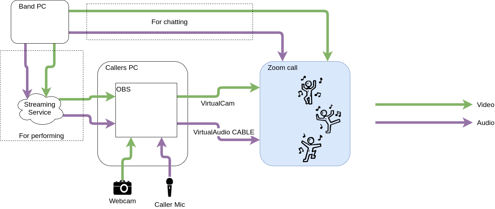

# Lag free calling for Virtual Dances

This is a technical guide on how to incorporate live music and live calling into a virtual dance without the issues of lag between caller and band.  The basic idea is to stream the band's music to the caller's PC, have the caller add the calls on top of that, and then send it off to the dancers.

This method doesn't allow for easy communication from the caller to the band.  Dance lengths will need to be agreed beforehand.

## The Band

1. Set up an account with a streaming service
   - I suggest [Twitch](https://www.twitch.tv/)
1. Download [OBS](https://obsproject.com/)
2. When installing OBS select options for streaming and follow instructions on linking OBS to the streaming service
3. ... Setup camera and audio ...
1. Suggestion of multiple scenes/hotkeys for when playing or not
4. Hit 'Start streaming' and send a link to the stream to the caller

## The Caller
### 1. Download and install the following
   - [OBS](https://obsproject.com/)
     - When asked about Streaming vs Recording, just hit close
   - [OBS-VirtualCam](https://github.com/CatxFish/obs-virtual-cam/releases/latest)
     - Make sure this is installed to the default directory
   - [VirtualAudio Cable](https://www.vb-audio.com/Cable/)
     - Extract before installing

### Setup OBS
##### Scenes and Sources
1. In the bottom left of OBS there is a scene list.  Create two scenes ['CallerOnly', 'Caller+Band']
2. Next to the scenelist is a list of sources.  Copy the webcam source into both scenes
   - If there isn't a webcam source, add a new `Video input capture` device.  The default settings will generally find the webcam.
3. Add a new `Audio input capture` source called CallerMic in both scenes, selecting the mic you would like to use
4. In the Caller+Band scene, create a new `Browser` source.  This should have the URL that the band has given you for their stream
5. Adjust the sizes and positions of the sources in the Caller+Band scene to your liking.  You may need to `right-click > interact` on the browser source to select a full-screen option for best effect.

##### Audio Routing
Next to the scene list is the audio mixer.  I suggest you mute everything that isn't mentioned below.
1. Click `Edit > Advanced Audio Properties`
2. Set the CallerMic and DesktopAudio sources to `Monitor and Output` in the Audio Monitoring drop-down
3. Close the Advanced Audio Properties window
4. Click `File > Settings > Audio`
5. In the `Advanced` section set the Monitoring Device to `CABLE Input`

##### Hotkeys
This set is optional, but makes switching between the scenes much easier
1. Click `File > Settings > Hotkeys`
2. I suggest that you set one hotkey for (eg. NUMPAD-+)
   - `Caller+Band > Switch to scene`
   - `Desktop Audio > Unmute`
3. and another hotkey for (eg. NUMPAD--)
   - `CallerOnly > Switch to scene`
   - `Desktop Audio > Mute`
4. Test out the hotkeys to check that they switch between your scenes

##### VirtualCam
1. Open `Tools > VirtualCam`
2. Press `Start`

##### Zoom
The last bit of setup is to channel all this into Zoom
1. Start Zoom
   1. Open `Zoom settings > Audio`
   1. Set Microphone as `CABLE Output`.  This is the monitoring device we set up using VirtualCable earlier
   1. Click `Advanced`
   1. Select `Enable Original Sound` option
   1. Open `Zoom settings > Video`
   1. Select `OBS-Camera` as camera.  This is the VirtualCam that we set up earlier
1. When starting the meeting, make sure that Original Sound is enabled.  IE. that the option shown is to _disable_ original sound
1. Join a call and **TEST EVERYTHING!** with the help of someone else on the call
   - Can you switch between scenes?
   - Can you be heard in both scenes?
   - Can the band's stream be heard in the Caller+Band scene?
   - Are you balanced with the band?
      - Change the levels of `Desktop Audio` and `CallerMic` in the OBS audio mixer
1. Enjoy the dances :)